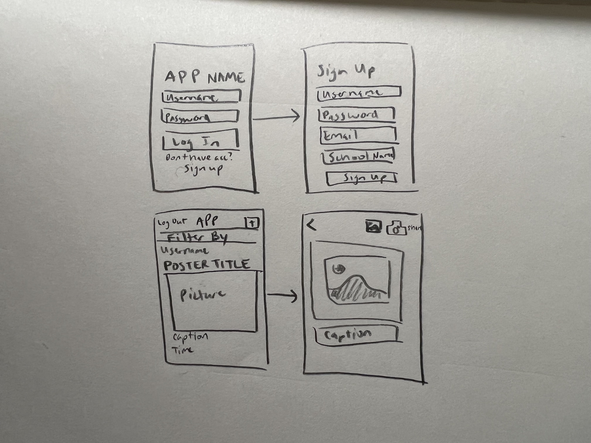

# CampFuzz
## Table of Contents
1. [Overview](#Overview)
1. [Product Spec](#Product-Spec)
1. [Wireframes](#Wireframes)
2. [Schema](#Schema)

## Overview
### Description
Allows students access a variety of events happening on campus. Can see users posts, 

### App Evaluation
- **Category:** Productivity
- **Mobile:** This app would be primarily developed for mobile so that users can check the latest posts. They may also use the camera to take pictures of posters on campus for events happening, but it could also eventually be extended to use on a computer like Instagram where functionality may be a bit more limited since you can't use the computer camera to upload posts.
- **Story:** Easier way to check on events and whats happening on campus. User will be able to see different upcoming events happening on campus and be able to filter through the ones that they want to see.
- **Market:** Students will be the primary market for the app--most likely high school and college students will benefit the most from it.
- **Habit:** This app could be used as often or unoften as the user wanted depending on how often they have time and are looking for cool new events to participate in/club events to join.
- **Scope:** V1 would allow students to post things events, posts. V2 would incorperate filters to search events, and somehow distinguish between what school you attend so that you can join your specific college community.

## Product Spec

### 1. User Stories (Required and Optional)

**Required Must-have Stories**

* Sign Up
* User logs in and logs out and can access previous posts
* Post, View
  * Original User can delete Post

**Optional Nice-to-have Stories**

* Filter by event category (for international students, by major, etc.)
* Input event time
* Be able to comment on the posts
* Save the posts and star the ones that you like or are interested in
* Get a notification when any events that you starred are starting soon
* ...

### 2. Screen Archetypes

* [Splash Screen]

* [Login Screen]

* [Sign up Screen]

* [Main Screen]
   * Post, View
   * Search
   * Log Out

* [Post Screen]
   * Create a Post (Camera) 
   * Description
   * Login

* [Profile Screen]
  * View previous post listing
  * Delete post

### 3. Navigation

**Tab Navigation** (Tab to Screen)

* [Main Screen]
   * Home feed
   * Create a post
   * Profile

**Flow Navigation** (Screen to Screen)

* [Login Screen]
   * [Main Screen]

* [Home Screen]
   * [Post Detail Screen]

## Wireframes
[Add picture of your hand sketched wireframes in this section]

### [BONUS] Digital Wireframes & Mockups

### [BONUS] Interactive Prototype

## Schema 
[This section will be completed in Unit 9]
### Models
[Add table of models]
### Networking
- [Add list of network requests by screen ]
- [Create basic snippets for each Parse network request]
- [OPTIONAL: List endpoints if using existing API such as Yelp]

